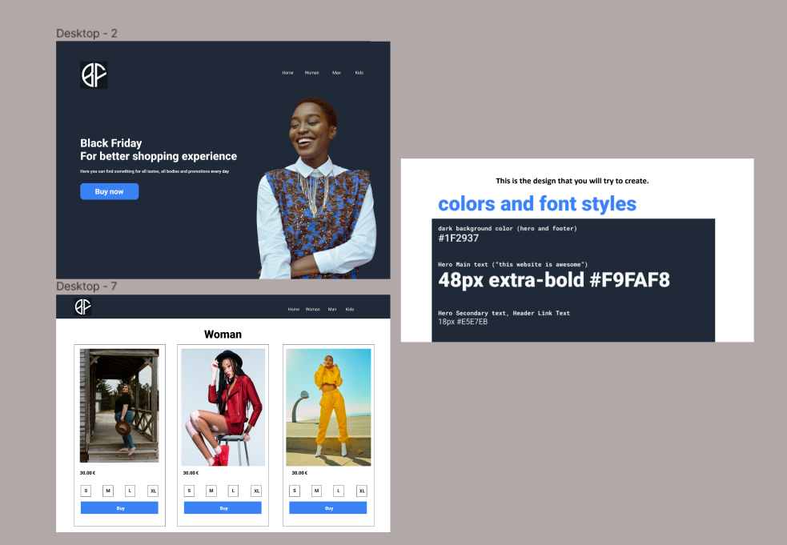
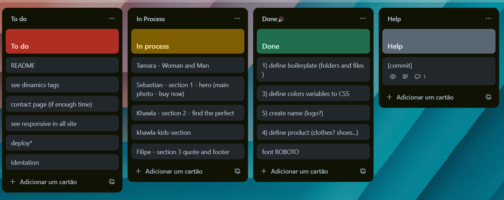
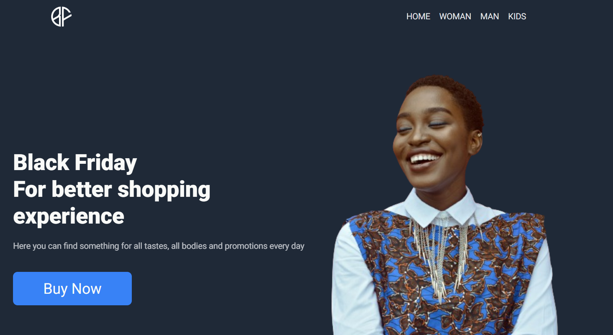
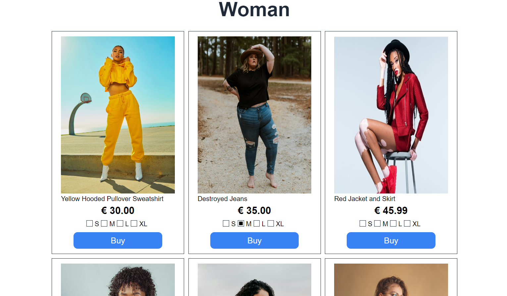

# 💻 KREATIVSTORM Project 
This project was developed as part of the KREATIVSTORM course, where we explore the nuances of web development using HTML and CSS. Our goal was to create a page that met the client's specific needs, incorporating design and functionality in a harmonious way, using semantic HTML.

## ✏️ Project description
The project consists of a personalized web page, designed to meet the client's specific demands. We use HTML to structure the content and CSS to style the page, ensuring a visually attractive and responsive experience.

## ✍️ *Design*
Using the FIGMA tool  

## 🎯 *Organization of tasks*
Using the Trello 

## 👗 *Product*
Black Friday - product sales for everyone with promotion every day 

## 📳 *Responsive*
Responsive website with a menu bar made only with HTML and CSS 
Demo:

https://github.com/FilipCern/assigment-css/assets/75817559/f55a1a64-0892-4fa3-aaa1-c756d5ec05de

## 👩‍💻 Squad
| Dev    | Github |
| -------- | ------- |
| Filip | https://github.com/FilipCern   |
| Khawla | https://github.com/Khawla-1006   |
| Stefan    | https://github.com/stefananghel93   |
| Tamara   | https://github.com/tamaracosta  |
